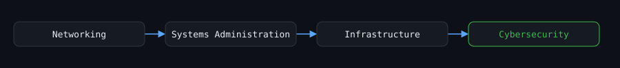

  

  

**Systems Administration · Network Infrastructure · Cybersecurity · IT Infrastructure**

I keep systems running, networks reachable, and infrastructure defensible.

---

  

---

## Core Focus

**Systems Administration**
Windows Server · Active Directory · DNS · DHCP · GPO · Linux · Microsoft 365

**Network Infrastructure**
TCP/IP · VLANs · Routing · VPN · Network Segmentation · Troubleshooting

**Infrastructure Security**
Wazuh / SIEM · OpenSearch · FortiGate · Firewall Administration · Log Monitoring · Hardening · Vulnerability Analysis

**Virtualization**
Hyper-V · Docker · Homelab

---

## Also builds software

Automation and infrastructure are the core, but I ship full-stack software when a project needs it — with the same discipline: automated testing, security-conscious defaults, and infrastructure-as-code for deployment. See Selected Work below.

---

## Selected Work

| Project | Description |
|---|---|
| [`gestão-de-backups`](https://github.com/JPagear/-gest-o-de-backups-) | Bash backup manager for static sites — started as a Sistemas Operativos assignment, hardened for real use: retention policy, disk-space and integrity checks, persistent logging, safe deletion guards. |
| [`127140-dhcp-azure`](https://github.com/JPagear/127140-dhcp-azure) | DHCP role deployed on an Azure Linux VM via Terraform + Ansible, zero manual configuration, no secrets committed. Solo project. |
| `MADAP` *(private)* | E-commerce/ERP platform — F# (Fable), React, Tailwind, with a Giraffe (.NET) API and its own test suite. |
| `EvoTrade` *(private)* | Algorithmic trading research platform (Python) — reinforcement learning, evolutionary agents, strict safety-gated architecture, systemd/Raspberry Pi deployment. |
| `Solidotel` *(private)* | Website redesign (Astro) — content and identity audit against the live site, automated cross-viewport QA. |
| `Vontaix` *(private)* | Production web platform (Astro + Node + PostgreSQL) — CMS, admin tooling, automated test suite. |

Also: [`Portifolio-Digital`](https://github.com/JPagear/Portifolio-Digital), a personal portfolio site.

---

## Technologies

**SYSTEMS**
Windows Server · Linux · Active Directory · Microsoft 365

**NETWORK**
DNS · DHCP · VLAN · Routing · VPN

**SECURITY**
Wazuh · SIEM · OpenSearch · FortiGate

**AUTOMATION**
Bash · Terraform · Ansible · Docker

---

## GitHub Activity

  

---

## Background

CTESP — Redes e Sistemas Informáticos (ESTGA), with hands-on coursework in networking, systems administration, cloud infrastructure, and distributed systems.

---

  

Some forked repositories on this profile are exploratory reads of third-party tools, not original work, and are intentionally left off this list.
